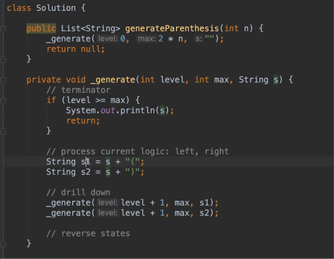
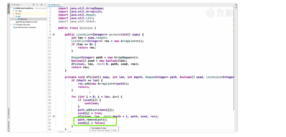
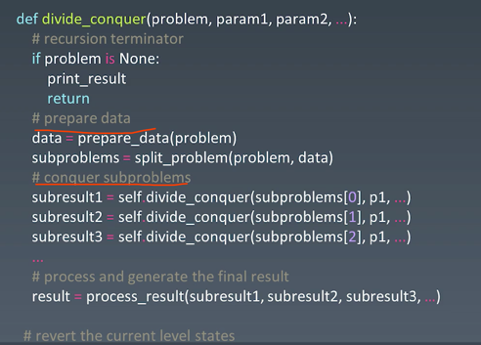

# 学习笔记

## 递归

1. 找到问题的重复性，问题可以从哪个纬度进行“收缩“，最终达到出口条件  
    如果没有思路怎么办？  
    - 举具体的列子
    - 画图，（树状、矩阵、列表等）
    - 通过模式识别 （如统计频次可以想到用hash，优化O(n)复杂度可以尝试分治

2. 递归代码模版

    - 
    - 
    - 

## 分治

1. 分解为多个子问题
2. 子问题进行组合
3. 栗子：最近公共祖先：分解为两个子树是否包含数字；验证二叉树：分解为两个子树是否是二叉树；

## 回溯

1. 应用场景：多个结果进行尝试，注意状态的重置，比如组合问题
2. 解题思路：该位置填写这个值，下一个位置填写的值的范围；回溯：状态清除，该位置尝试填写其他值

## 优化

1. 存储已经计算过的结果
2. 剪枝：提前去掉不合法的分支
