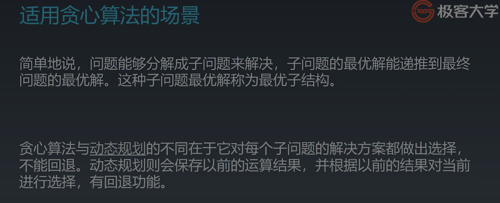
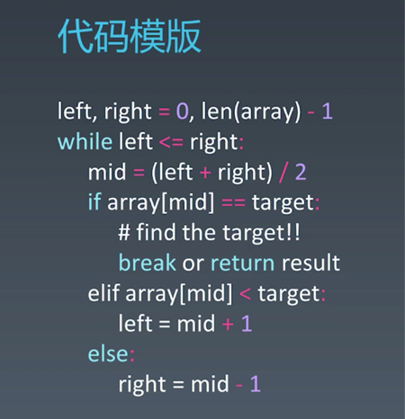
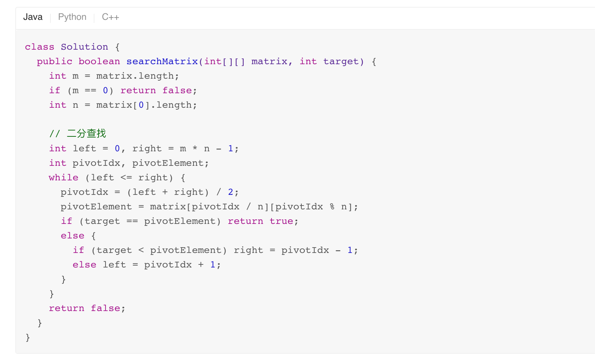

# 学习笔记

## 解题思路

将问题转换成对应的模型，比如岛屿数量，扫雷游戏，这种扩散类型，感染类型的题目一般可以使用广度优先或者深度优先遍历进行解决

## 广度优先遍历

1. 数据结构使用队列作为数据结构。
2. 使用场景：
    - 求扩散，感染类的题目
    - 使用求最短路径类型题目，

## 贪心算法

1. 特点：局部最优，只看眼前
2. 如何证明眼前最优的解会是全局最优的解比较关键
3. 适用场景

## 二分查找

1. 在存在单调性的情况可以使用二分查找，把O(n)复杂度减低到O(logn)
2. 代码模版

